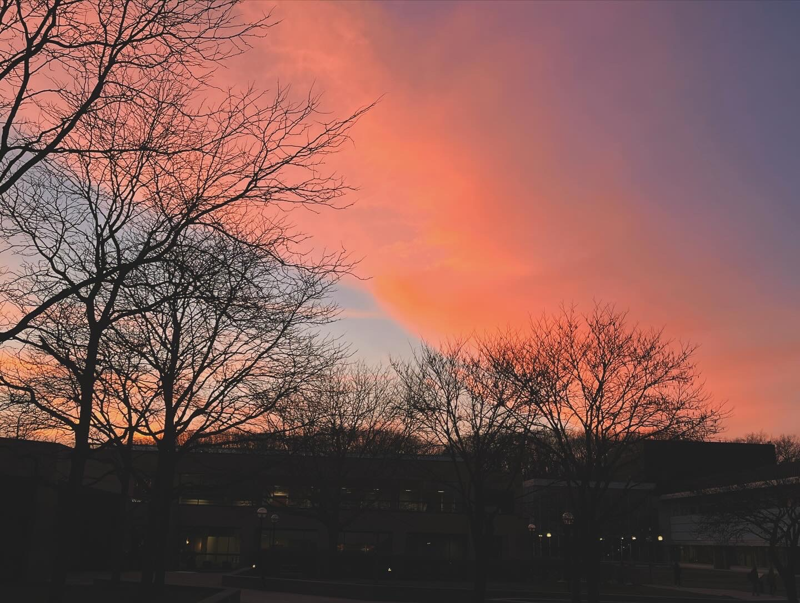
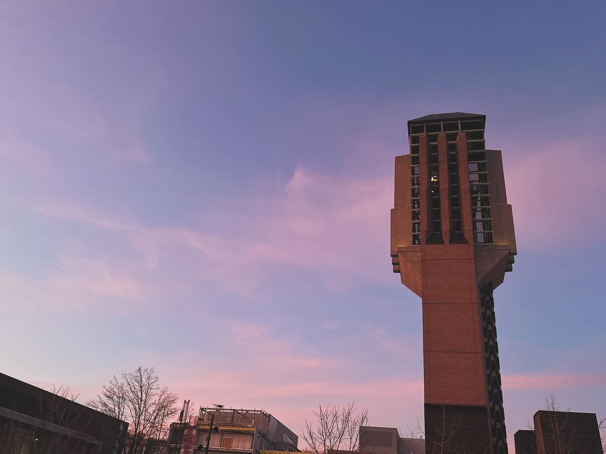
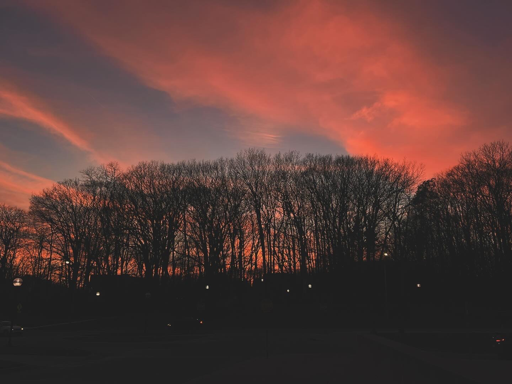
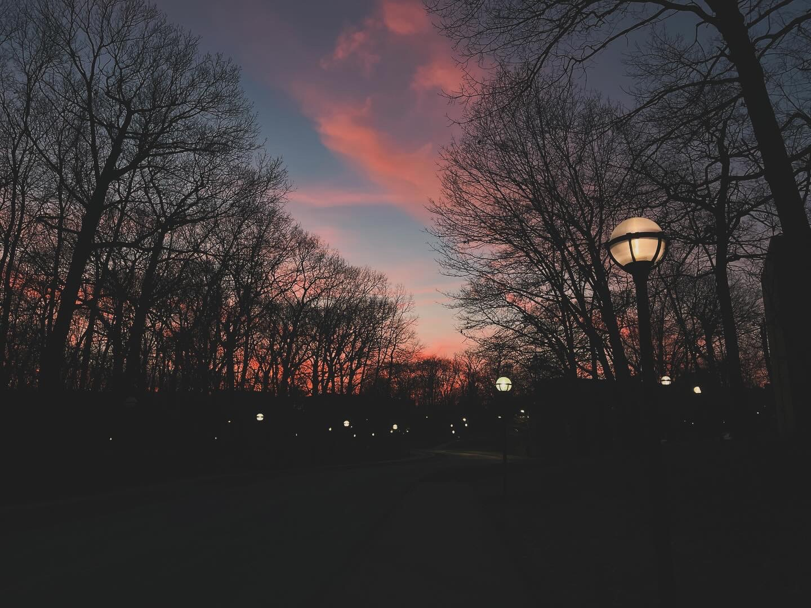
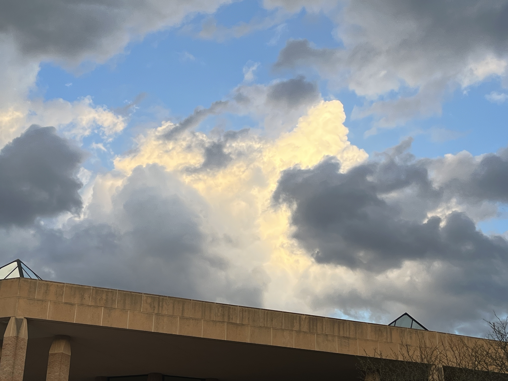
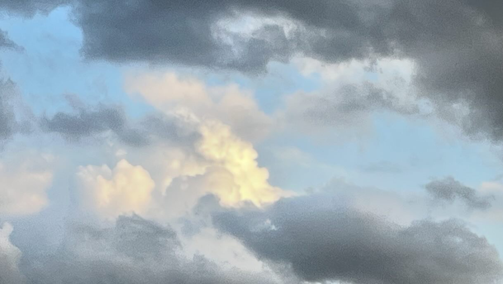
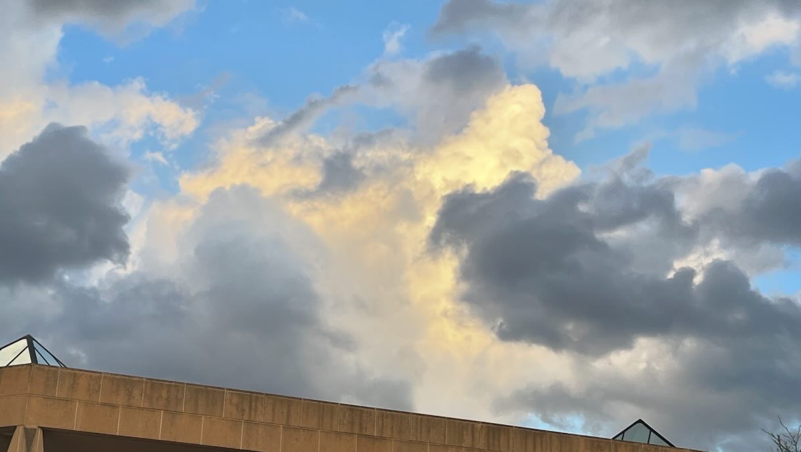
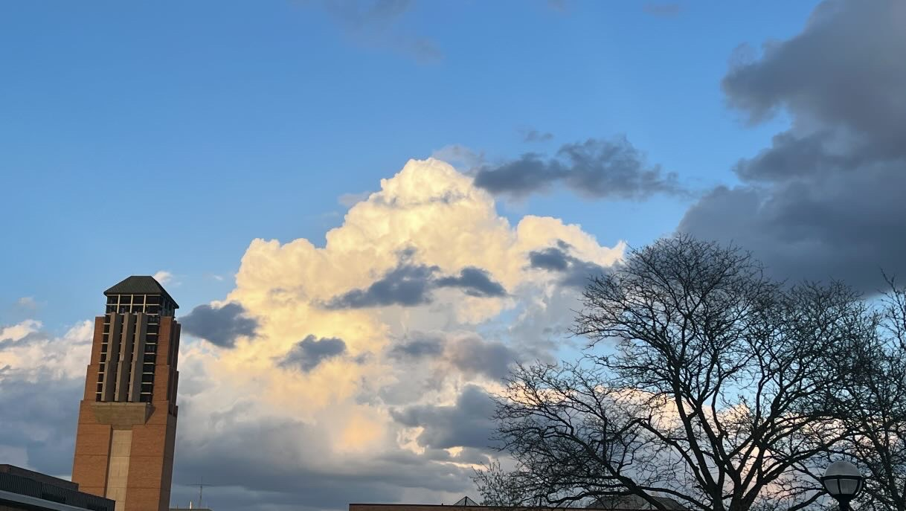
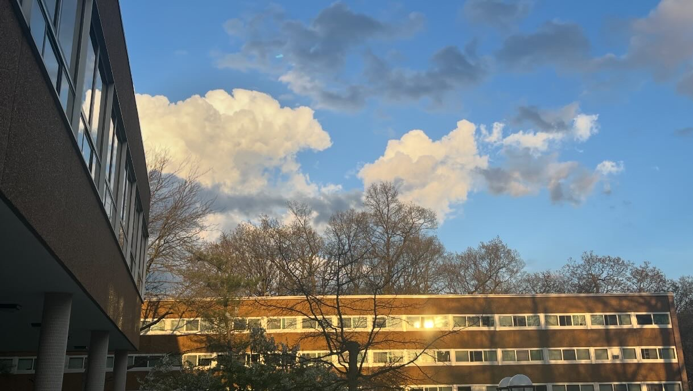

# Look at the sky

夜半突然有些忧郁，随便写下点文字。既然是日记，就用我最熟悉的语言了。

在生命被压住的那些瞬间，被掩藏的小径总会被拨开，记录下未来的希冀和美好。

被享受的时间就是对生命最大的尊重了吧。

好好生活是一种责任，而非选择。

看看最近的天吧。

那是梦想的颜色。

---

这些是两个月前拍的照片，但完全改变了我对自然界的美的感知。

这样如此鲜艳而富有张力的环境竟然是真实的。

这才是生活该有的样子。

*火烧云*

*火烧云下的北校钟楼*

*树林后的火烧云*

我最喜欢的一张。色彩的出现和分布美丽的有些不真实。

*云层照亮的小径*

---

下面这些是今天拍的。在这之前我从没想到云层有如此丰富的细节和质感。

在云层最明亮的时候，钟声响起。那我只在游戏里见过的场景在现实中复刻。八点的钟敲了八下，在最后一下响起的时候，我最终来得及按下了快门。

那些瞬间提醒着我这一切的美好。


