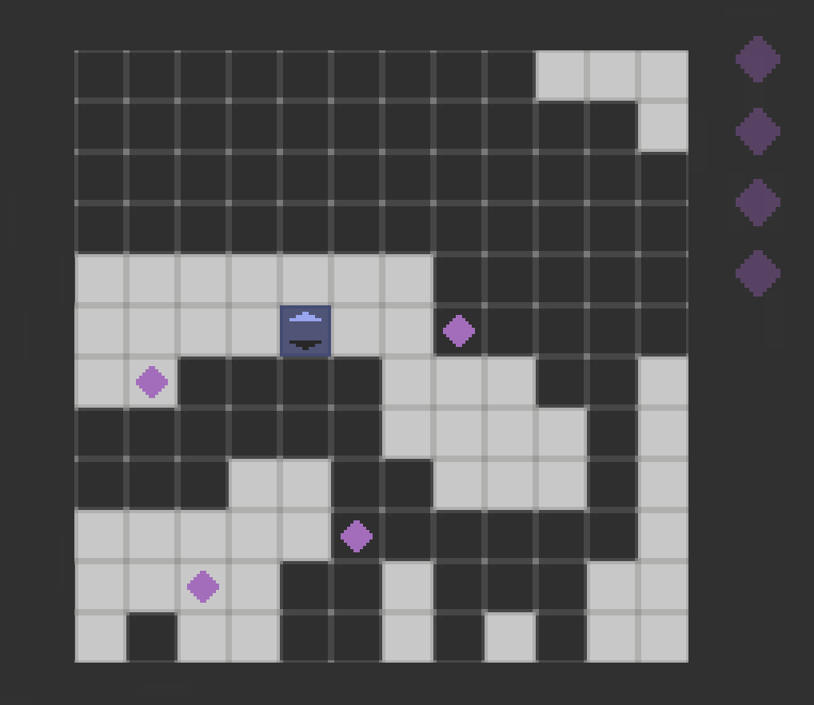

# Technologies Used

The major tool we use for game reconstruction is [Unity](https://unity.com/), which uses [C#](https://en.wikipedia.org/wiki/C_Sharp_(programming_language)) as scripting language

# Project 1: Replicating Classical *The Legend of Zelda*

## Overview

Uniqname: arbitsv

This project is mainly about replicating the famous [1986 NES ver. *The Legend of Zelda*](https://en.wikipedia.org/wiki/The_Legend_of_Zelda_(video_game)). The executables can be found below:

- MacOS: [here](https://drive.google.com/file/d/1ly5ACAA8uvWfpm9Rb9FL9b2TY-9EiUiB/view?usp=drive_link)
- Windows: [here](https://drive.google.com/file/d/1YeUPdkk1Z3Zt67oMfKDsZGO2tMSNms-U/view?usp=drive_link)

# Project 2: Rapid Prototyping (*No Easy Pace*)

## Overview

This project is single-person and 2-week-long, which aims at finishing an interesting mechanism of game with minimal other things. The executables can be found below:

- MacOS: [here](https://drive.google.com/file/d/1IShAYGw7Q6iQ7EF1yGAYckHXv3fOtgS9/view)
- Windows: [here](https://drive.google.com/file/d/1VbxrT_OUYGrDM43Z811Pj_TtG8RAA326/view)

## Briefing the Mechanism

The game is based on the classical platforming game framework, but with the modification that the player's movement is largely restricted, and classical setups do not necessarily work here (thinking about walking in the wall!). Due to the limitation of time, the level design is simple, but definitely more can be added to this. 

By the way, some of the designs are inspired by the game [*Leap Year*](https://store.steampowered.com/app/2951770/Leap_Year/), a game that I highly recommend as well!

